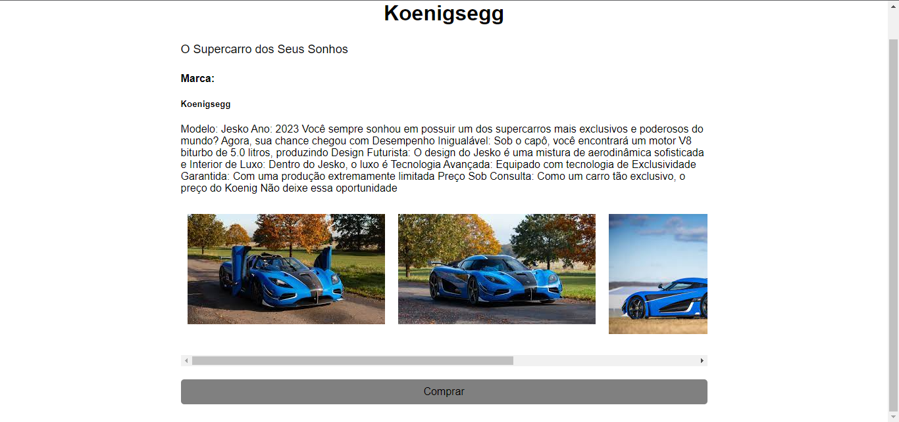
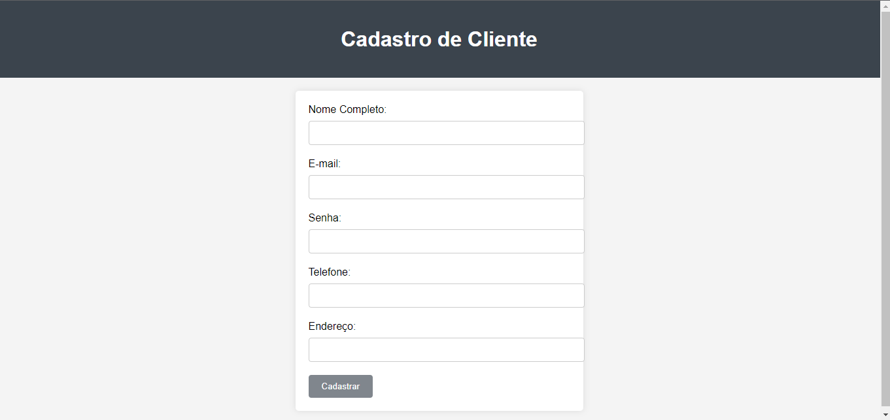

# 🚀 sejam todos bem vindo ao meu repositorio 

## Iindice
   - [Projeto - Loja de carros](#projeto---aprendendo-a-escrever-um-readme)  
   - [Descrição](#descris%C3%A3o)  
   - [Introdução](#introdu%C3%A7%C3%A3o)  
   - [Funcionalidades](#funcionalidades)  
   - [Tecnologias Utilizadas](#tecnologias-utilizadas)  
   - [Fontes Consultadas](#fontes-consultadas)  
   - [Autores](#autores)  

# 🚗 Simulação de Uma Loja De carros

# ✅Descrisão 
   esse site está sendo desenvolvido para simular compra de veiculos.
   

# 📃 Introdução
estou criando um site cujo o objetivo é simular um site de compra de veiculos tem varias opções de veiculos.
   
   
   quando clicamos em um dos veiculos aparece uma descrição bem detalhada com todas as informações e fotos importando do veiculo (a estilização está em fase beta).
   

   ainda está em deselvovimento, mas a página ja tem uma aréa de cadastro(que ainda não está disponivel para uso).
   
   
## 🔧 Funcionalidades
   °simular um site de venda veiculos

## 📌 Tecnologias Utilizadas
   °Html 
   °Css  

## 🔎 Fontes consultadas
   [Mozilla](https://developer.mozilla.org/pt-BR/docs/Learn/CSS)  
   [Alura](https://www.alura.com.br/artigos/escrever-bom-readme)
   [repositorio_gifhub](https://github.com/hideraldus13/github-emoji)  
## ✒️ Autores
[Leonardo De Oliveira](https://github.com/leoOliveiraBR)  
